<p align="center">
  
</p>

Tiêu đề: Logo PixelBrief
Mục đích: Bộ nhận diện thương hiệu cho tiện ích mở rộng PixelBrief
Alt text: Logo PixelBrief với 4 góc khung chọn và cursor click
Nguồn: public/pixelbrief_logo.svg
Chú thích: Logo thể hiện trực quan chức năng khoanh vùng và chọn phần tử trên trang web.

# PixelBrief - AI Agent UI Annotator

> Visual webpage annotation extension for Chrome (Manifest V3) that generates structured prompt bundles and screenshots for AI coding agents.

[](#installation)
[](#extension-permissions)
[](#installation)
[](#license)

---

## Overview & Why it exists

When developers, designers, or product managers pair-program with AI coding agents (such as Antigravity, Devin, or Cursor), describing visual layout bugs or design tweaks via text alone is slow and error-prone. 

**PixelBrief** bridges this gap by enabling you to draw directly on any live webpage. You can circle issues, draw direction arrows, type text labels, and place numbered comment pins. PixelBrief compiles these visual markings, the webpage URL/viewport size, and your text comments into a unified, structured prompt bundle (Markdown + ZIP + screenshot) that AI agents can parse and execute immediately.

---

## Key Features

| Capability | Practical Benefit | Limitations |
| :--- | :--- | :--- |
| **Floating Toolbar** | Moveable control interface containing Selection, Rectangle, Ellipse, Arrow, Freehand Pen, Pin, and Text tools. Easily change color swatches and stroke widths. | Toolbar can be dragged anywhere in the viewport, but might overlap target webpage content if space is constrained. |
| **Scroll Synchronization** | Vector annotations are locked to document-relative coordinates rather than viewport positions, meaning drawings scroll naturally with the page. | If page elements shift dynamically (e.g. responsive layout re-flow, sliding modals, or lazy loading), annotations remain anchored to their original absolute coordinates. |
| **Shadow DOM Isolation** | The extension overlay is mounted inside a closed Shadow DOM root, isolating extension styles from the host page. | A closed Shadow DOM blocks host page stylesheet interference, but exceptionally aggressive global resets or inherited font properties might still affect sub-elements. |
| **Zustand & Local Sync** | Annotations and drafts are automatically synchronized to the local state and cached in `chrome.storage.local` per URL path. | Cleared browser storage or private/incognito session resets will remove saved annotation data. |
| **Side Panel Manager** | Lists all page annotations and comments chronologically. Supports click-to-zoom to quickly center a target annotation in the viewport. | Viewport scrolling only triggers if the selected annotation is currently out of view. |
| **ZIP Bundle Export** | Packages an annotated viewport screenshot (`screenshot.png`), structured prompt (`prompt.md`), and raw JSON coordinates (`annotations.json`) into a single ZIP archive. | Only captures the visible viewport. Dynamic videos or canvas contents might not be properly rendered in the screenshot depending on browser tab capture API behavior. |

---

## Quick Start & Installation

### Prerequisites
* **Node.js**: Version 18.0.0 or higher.
* **npm**: Package manager (pre-installed with Node.js).

### Step-by-Step Setup

1. **Clone the Repository**:
   ```bash
   git clone https://github.com/thanhdiner/Pixel-Brief.git
   cd Pixel-Brief
   ```

2. **Install Dependencies**:
   ```bash
   npm install
   ```

3. **Build the Production Bundle**:
   ```bash
   npm run build
   ```
   *Expected Output*: The build process compiles React, TypeScript, and Tailwind CSS files into the `dist/` directory. You should see files like `dist/content.js`, `dist/background.js`, and `dist/content.css`.

4. **Load into Google Chrome**:
   * Navigate to `chrome://extensions` in your browser address bar.
   * Enable **Developer Mode** using the toggle switch in the top-right corner.
   * Click the **Load unpacked** button in the top-left corner.
   * Select the `dist/` folder from the root of this project.
   * *Expected Result*: The PixelBrief card should appear in your extensions list, indicating it is active and loaded.

---

## Usage & Workflow

### 1. Activating the Overlay
Open any standard website (like a local development server `http://localhost:3000` or a public page). 
* Press **`Ctrl+Shift+M`** (or **`Cmd+Shift+M`** on macOS).
* Or click the PixelBrief extension icon in the toolbar, then click **Toggle Overlay**.
* *Expected Result*: A translucent drawing canvas will cover the screen, and the floating toolbar will appear at the top.

### 2. Drawing and Commenting
* Select a tool from the floating toolbar (or use keyboard hotkeys).
* Draw rectangles, ellipses, arrows, or freehand sketches directly over elements you want changed.
* Choose a **Comment Pin** tool (`N`) and click a location. Click on the pin or open the Side Panel to type your detailed request.
* Choose a color from the swatch color picker to categorize or color-code requests (e.g. Red for bugs, Orange for modifications).

### 3. Exporting the Prompt Bundle
* Click **Copy AI Prompt** from the toolbar menu to copy a structured markdown template to your clipboard.
* Click **Export Bundle (ZIP)**.
* *Expected Result*: The extension will temporarily hide the UI overlays, capture the screen, combine the drawing and comments, and trigger a download of a ZIP file containing:
  - `screenshot.png`: Viewport screenshot with drawings overlayed.
  - `prompt.md`: A structured markdown prompt containing detailed coordinates and requests.
  - `annotations.json`: Raw coordinate data for programmatic consumption.

### Keyboard Shortcuts

| Key | Action | Description |
| :---: | :--- | :--- |
| **`Ctrl+Shift+M`** | Toggle Overlay | Opens or closes the PixelBrief canvas overlay |
| **`V`** | Select / Move Tool | Selects and moves existing drawing shapes or pins |
| **`R`** | Rectangle Tool | Draws rectangular highlights |
| **`O`** | Ellipse Tool | Draws circular or elliptical highlights |
| **`A`** | Arrow Tool | Draws direction indicators |
| **`P`** | Pen Tool | Freehand drawing tool |
| **`N`** | Comment Pin Tool | Places a numbered pin to write text annotations |
| **`T`** | Text Label Tool | Writes text labels directly onto the canvas |
| **`H`** | Hide/Show Overlay | Temporarily hides/shows annotations without closing the overlay |
| **`Ctrl + Z`** | Undo | Undo the last annotation action |
| **`Ctrl + Shift + Z`** | Redo | Redo the last undone annotation action |
| **`Backspace` / `Delete`** | Delete | Deletes the currently selected annotation |
| **`Escape`** | Cancel / Exit | Closes popovers, deselects elements, or closes the overlay |

---

## Extension Permissions

The extension requests the following permissions in `manifest.json`. Each permission is tied directly to core functionality:

| Permission | Purpose | Core Feature Dependent |
| :--- | :--- | :--- |
| `activeTab` | Allows injecting scripts, drawing overlays, and capturing viewport images on the active web tab. | Canvas overlay & Screenshot capture |
| `scripting` | Used to dynamically inject the content script when the overlay is toggled. | Toggling the overlay UI |
| `storage` | Saves and restores drawing shapes and comments locally per-URL. | Persistent annotations across tab reloads |
| `tabs` | Queries browser tab attributes to maintain communication channels between the background service worker and content overlays. | Toolbar control and toggling |
| `clipboardWrite` | Enables copy-to-clipboard functionality for exporting the structured AI prompt. | **Copy AI Prompt** button |

---

## Architecture & How it Works

PixelBrief follows a decoupled architecture using Chrome Extension APIs (Manifest V3), a React shadow DOM overlay, and Zustand state synchronization.

```mermaid
sequenceDiagram
    autonumber
    actor User
    participant Chrome as Chrome Browser
    participant BG as "Service Worker (background.js)"
    participant CS as "Content Script (content.js)"
    participant SD as "Shadow DOM (React Overlay)"
    participant Store as "Local Storage (Zustand + chrome.storage)"

    User->>Chrome: Press Ctrl+Shift+M / Click Icon
    Chrome->>BG: Trigger Shortcut / Action
    BG->>CS: Send "TOGGLE_OVERLAY"
    CS->>Store: Query saved annotations
    Store-->>CS: Return saved data
    CS->>SD: Mount React App inside Shadow DOM
    SD->>Store: Load annotations into state
    SD-->>User: Render Canvas, Toolbar & Side Panel

    rect rgb(39, 39, 42)
        Note over User, Store: Drawing & Local Auto-Saving
        User->>SD: Draw shape / Add comment
        SD->>Store: Update state & chrome.storage.local
    end

    rect rgb(39, 39, 42)
        Note over User, Store: Export ZIP Bundle Flow
        User->>SD: Click "Export Bundle (ZIP)"
        SD->>Store: Set isCapturing = true (hide UI overlays)
        SD->>BG: Send "CAPTURE_SCREENSHOT"
        BG->>Chrome: Capture visible tab viewport
        Chrome-->>BG: Return PNG Data URL
        BG-->>SD: Return Data URL
        SD->>SD: Render screenshot + vector drawings to canvas
        SD->>SD: Package ZIP (JSZip)
        SD-->>User: Trigger download of pixelbrief-bundle.zip
        SD->>Store: Set isCapturing = false (restore UI overlays)
    end
```



Tiêu đề: Sơ đồ tương tác kiến trúc PixelBrief
Mục đích: Biểu diễn luồng điều khiển và truyền tải dữ liệu giữa các thành phần Chrome Extension
Alt text: Sơ đồ tuần tự thể hiện tương tác của người dùng, Service Worker, Content Script, Shadow DOM và Local Storage
Nguồn: Sơ đồ tự tạo bằng Mermaid
Chú thích: Hãy chú ý bước 15-22, khi giao diện tạm ẩn để Service Worker chụp màn hình sạch trước khi gộp các nét vẽ.

---

## Troubleshooting

### Symptom: Overlay does not appear
* **Cause**: Chrome security policies restrict extension script injection on system tabs (`chrome://*`), the Chrome Web Store, or protected system settings. Alternatively, if the extension was just updated or re-loaded, the page target must be refreshed.
* **Fix**: Open a standard webpage (e.g. `https://example.com` or localhost) and reload the webpage to allow the content script to initialize.

### Symptom: Screenshot capture fails / blank screenshot
* **Cause**: `chrome.tabs.captureVisibleTab` requires the tab to be fully loaded, visible in the foreground, and not blocked by browser security restrictions.
* **Fix**: Wait for the target webpage to finish loading completely, make sure the browser window is active, and click the export button again.

### Symptom: Extension styles are distorted or broken on certain pages
* **Cause**: Although PixelBrief is mounted inside a Shadow DOM, extreme CSS resets or high-specificity font families defined on the host page might still leak through or override defaults.
* **Fix**: Verify if the host page uses aggressive global styles. PixelBrief isolates core styling within a closed Shadow DOM, which blocks 99% of stylesheet leaks.

---

## Project Structure

```text
PixelBrief/
├── public/                 # Static assets (icons, manifest.json, logo)
├── src/
│   ├── background/         # Background service worker (toggles overlay and captures screen)
│   ├── content/            # Injection script; mounts React overlay inside Shadow DOM
│   └── overlay/            # React UI components and state management
│       ├── components/     # Canvas, floating toolbar, color picker, and side panel
│       ├── utils/          # Export generators, geometry calculations, and ZIP builders
│       ├── store.ts        # Zustand state store with chrome.storage persistence
│       └── types.ts        # TypeScript interface definitions for shapes & state
├── index.html              # Development sandbox page
├── popup.html              # Extension browser action popup
├── vite.config.ts          # Vite build and bundle configuration
└── package.json            # Scripts, dependencies, and devDependencies
```

---

## Contributing

Contributions are welcome! Please follow these guidelines:
1. Fork the repository and create a new feature branch.
2. Ensure your changes do not introduce type errors or lint warnings.
3. Keep layout controls responsive and compatible with standard browser window sizes.
4. Submit a Pull Request describing your changes.

## Security

PixelBrief operates entirely client-side. Drawing coordinates and text comments are saved directly into your browser's local extension storage (`chrome.storage.local`). No visual assets, comments, page URLs, or screenshots are ever transmitted to external servers.

## License

This project is licensed under the [MIT License](#license).
 fixed at their original absolute document coordinates.

---

## License

MIT License.
